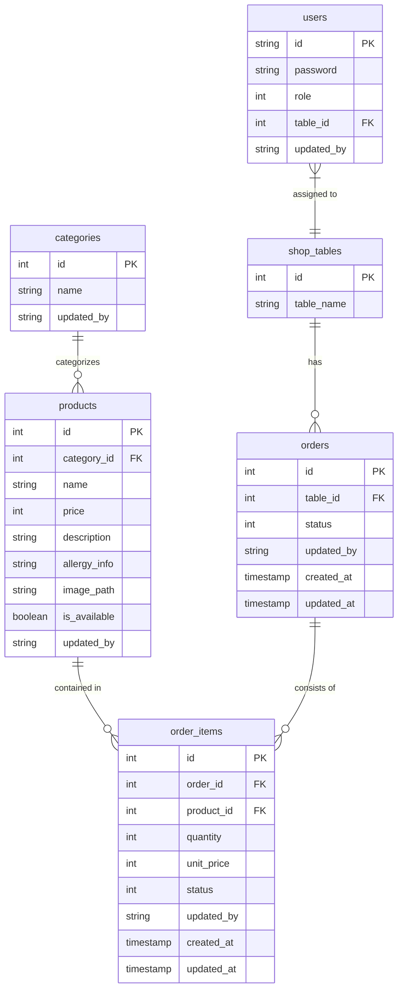
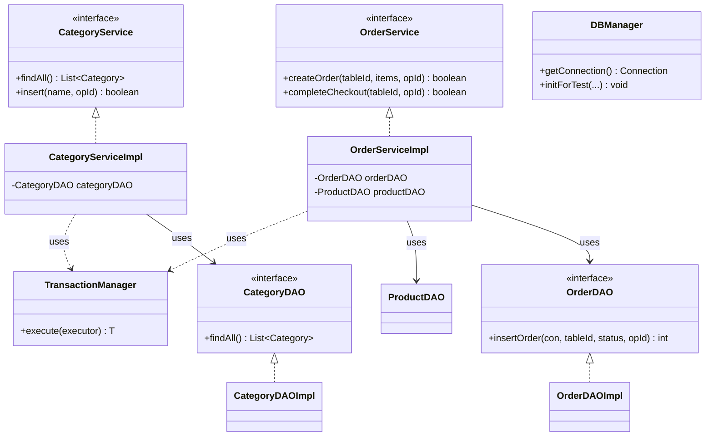

# Table Order System: アーキテクチャ定義 (Architecture Definition)

本プロジェクトのパッケージ構造、レイヤーの責務、および命名規則を定義します。開発時およびAIエージェントによるコード生成時は、本構造を厳守してください。

## 0. 技術選定基準 (Technology Selection Criteria)

本プロジェクトがモダンな言語（Node.js, Go等）ではなく、あえて **Java 17 / Jakarta Servlet** を採用している理由は以下の通りです。

1.  **長期的な保守性と安定性**: Java エコシステムは「20年後もメンテナンス可能であること」を前提としており、ミッションクリティカルな店舗管理システムにおいて、技術の寿命とパッチ提供の継続性は最大の安心材料となります。
2.  **ビジネスロジックの堅牢性**: 強力な型システムと成熟したトランザクション管理機能により、在庫や売上といった「1円・1個の不整合も許されない」ロジックを安全に実装できます。
3.  **高度な並行処理**: Java のネイティブスレッド（および将来的な仮想スレッド）モデルにより、多店舗展開時の大量の同時リクエストに対しても、効率的かつ直感的なコードで高いパフォーマンスを発揮します。
4.  **厳格な品質管理**: Checkstyle や Spotbugs といった強力な静的解析ツール、および JUnit による網羅的なテストが可能であり、属人的なミスを排除した「ハードゥニング（堅牢化）」されたコードベースを維持できます。

## 1. パッケージ構造と責務 (Package Structure)

| パッケージ | 役割・責務 |
| :--- | :--- |
| `controller` | **プレゼンテーション層 (Servlet)** HTTPリクエストの受付、パラメータの収集、バリデーション呼び出し、Service層の実行、JSPへの遷移制御を担当します。 |
| `service` | **ビジネスロジック層 (Interface)** 業務ルール、トランザクション境界、複数のDAOを跨ぐ処理、外部サービス（Cloudinary等）との連携を定義します。 |
| `service.impl` | **ビジネスロジック層 (Implementation)** Serviceインターフェースの実装クラス。 |
| `database` | **データアクセス層 (Interface / Constants)** CRUD操作の定義、および `SqlConstants` によるSQL文の一元管理を担当します。 |
| `database.impl` | **データアクセス層 (Implementation)** DAOインターフェースの実装クラス。JDBCを用いた具体的なDB操作を行います。 |
| `model` | **ドメイン・データモデル (DTO)** Java 17 `record` を用いた不変なデータ構造、および業務で使用する定数（`OrderConstants`等）を定義します。 |
| `filter` | **横断的関心事 (Filter)** 認証チェック（AuthFilter）、文字エンコーディング適用、共通ログ出力などを担当します。 |
| `exception` | **例外クラス** プロジェクト共通のカスタム例外（`BaseException`, `BusinessException`, `DatabaseException`等）を定義します。 |
| `util` | **共通ユーティリティ** バリデーション（`ValidationUtil`）、パスワード操作（`PasswordUtil`）、外部連携（`CloudinaryUtil`）などの静的メソッド群。 |

## 2. レイヤー間の依存ルール (Layer Dependencies)

1.  **単方向の依存**: 依存関係は `controller` → `service` → `database` の一方向とし、逆方向の依存や循環参照は禁止します。
2.  **インターフェースの活用**: `controller` は `service` の、`service` は `database` の**インターフェース**にのみ依存します。実装クラス（`impl`）を直接インスタンス化せず、`ServiceFactory` 等のファクトリ、またはDIコンストラクタを経由します。
3.  **データ交換**: レイヤー間のデータのやり取りには `model` パッケージ内の `record` または基本型を使用します。

## 3. 命名規則 (Naming Conventions)

| 対象 | 規則 | 例 |
| :--- | :--- | :--- |
| Servlet | `XXXServlet` | `LoginServlet`, `ProductAdminServlet` |
| Service | `XXXService` (Interface) / `XXXServiceImpl` (Impl) | `OrderService`, `OrderServiceImpl` |
| DAO | `XXXDAO` (Interface) / `XXXDAOImpl` (Impl) | `UserDAO`, `UserDAOImpl` |
| Exception | `XXXException` | `BusinessException`, `DatabaseException` |
| 定数クラス | `XXXConstants` | `SqlConstants`, `OrderConstants` |
| JSPファイル | スネークケース（小文字） | `admin_home.jsp`, `menu.jsp` |

## 4. 画面遷移とルーティング

- Servletへのマッピングは、アノテーション `@WebServlet("/XXX")` を使用します。
- 原則として、URLパターンとServletクラス名を一致させます（例：`LoginServlet` は `/Login`）。

## 5. ER図 (Entity Relationship Diagram)

本システムのデータベース構造は以下の通りです。

## 6. クラス図 (Class Diagram)

主要なレイヤー構造とインターフェース・実装の関係を示します。

