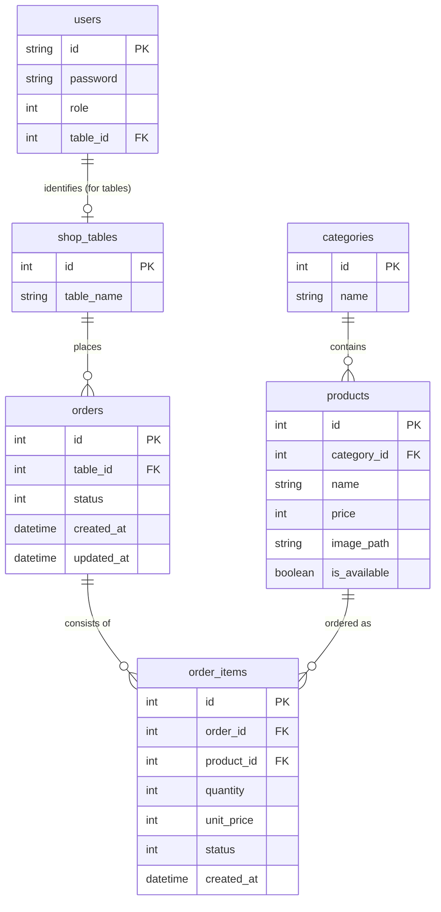

# データベースER図

テーブルオーダーシステムのデータベース構造を視覚化したものです。

## テーブル説明

- **users**: システムを利用するユーザー。`role` カラムにより以下の権限を区別します。
    - **1: 管理者 (Admin)** - システム全体の管理（商品登録、ユーザー管理など）
    - **2: キッチン (Kitchen)** - 注文確認、調理完了操作、商品の販売停止操作
    - **3: ホール (Hall)** - 配膳完了操作
    - **4: 会計 (Cashier)** - 会計処理、精算完了操作
    - **10: テーブル用端末 (Table)** - 客席からの注文操作
- **shop_tables**: 店内の座席情報。
- **categories**: 商品のジャンル（ドリンク、フード等）。
- **products**: 商品マスタ。キッチンの判断で販売停止（`is_available=0`）が可能。
- **orders**: 来店から会計までの「1回の訪問」を管理。
- **order_items**: 注文された個々の商品とそのステータス（調理中・配膳済等）を管理。
