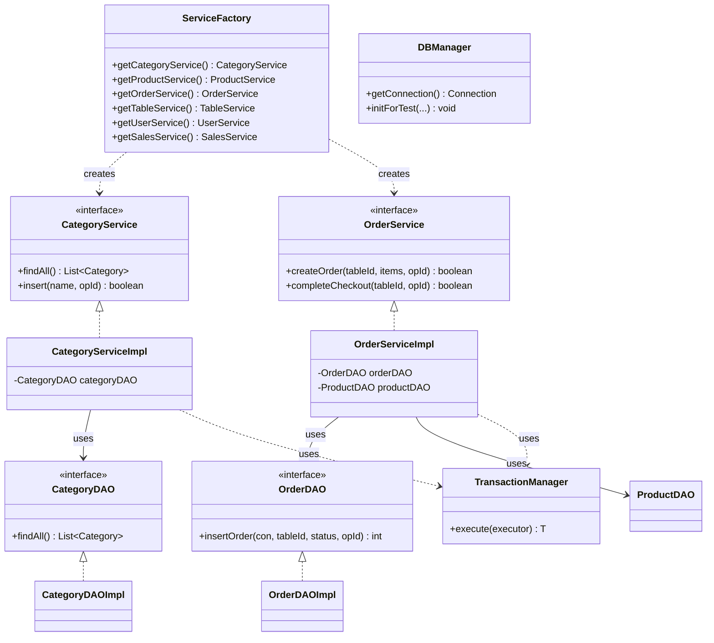

# クラス図

テーブルオーダーシステムの主要なクラス構成を示す図です。
最新のアーキテクチャでは、Service層の全面導入、モデルの `record` 化、および依存性注入（DI）のための `ServiceFactory` が導入されています。

## 各層の役割

- **Controller層 (Servlets)**: `ServiceFactory` を介してサービスを取得し、ビジネスロジックを実行します。入出力の制御に専念します。
- **Service層**: 業務ルール、トランザクション管理、外部サービス連携を担当します。インターフェースによって抽象化されています。
- **DAO層**: データベース操作を担当します。SQLは `SqlConstants` に集約され、静的な安全性が確保されています。
- **Model層**: `record` を使用して不変なデータモデルを定義します。
- **Exception層**: 業務エラーとシステムエラーを階層的に管理し、一貫したエラーハンドリングを実現します。
- **Utility層**: 画像アップロード（Cloudinary）やパスワードハッシュ化などの共通機能を提供します。
