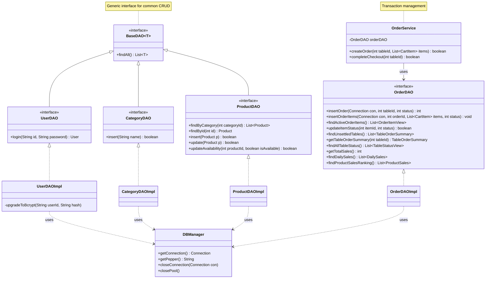

# クラス図

テーブルオーダーシステムの主要なクラス構成を示す図です。
特にDAO層のインターフェース抽象化と、サービス層・コントローラー層との関係を視覚化しています。

## 各層の役割

- **Controller層 (Servlets)**: リクエストを受け取り、適切なServiceやDAOを呼び出して結果をJSPへ渡します。
- **Service層 (OrderService)**: 複数のDAO呼び出しを組み合わせた複雑なビジネスロジックや、トランザクション境界（commit/rollback）を管理します。
- **DAO層 (Data Access Objects)**: データベースとの直接的な対話を受け持ちます。インターフェースによって具象実装が隠蔽されています。
- **Database (DBManager)**: 接続プール（HikariCP）の管理とコネクションの提供を行います。
